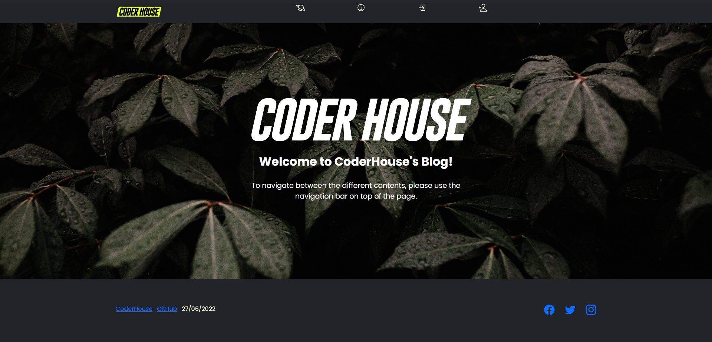
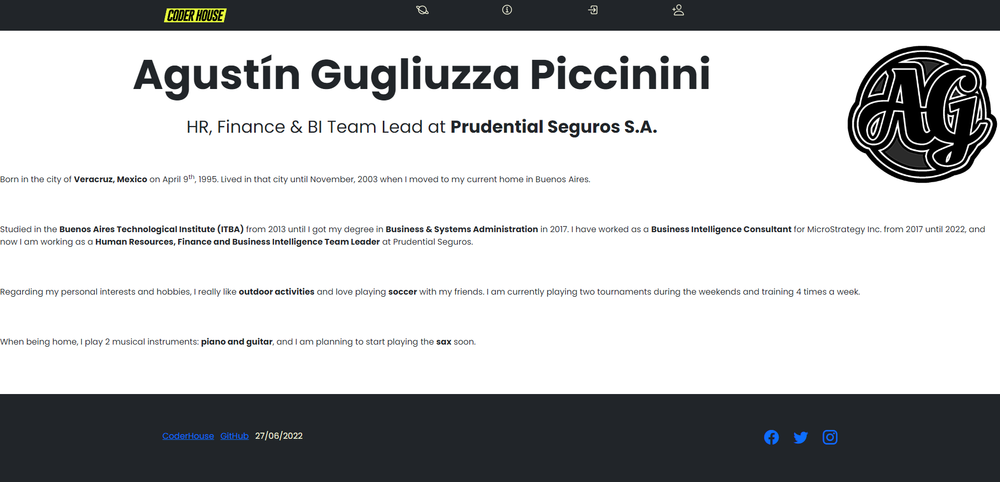
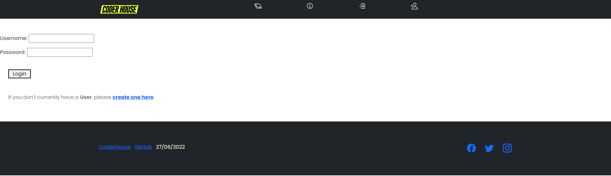
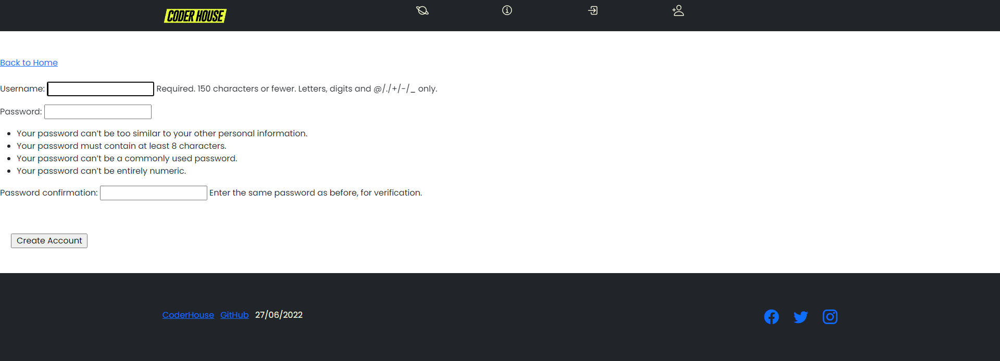
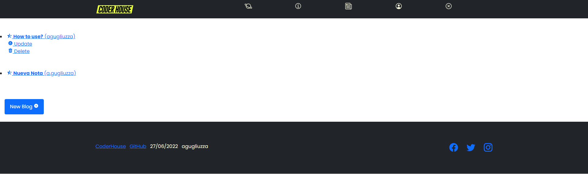
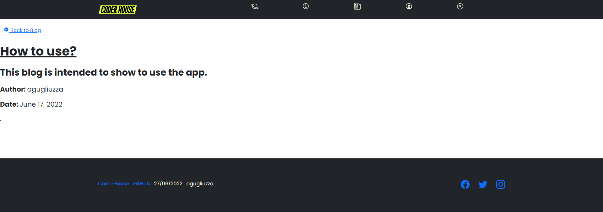
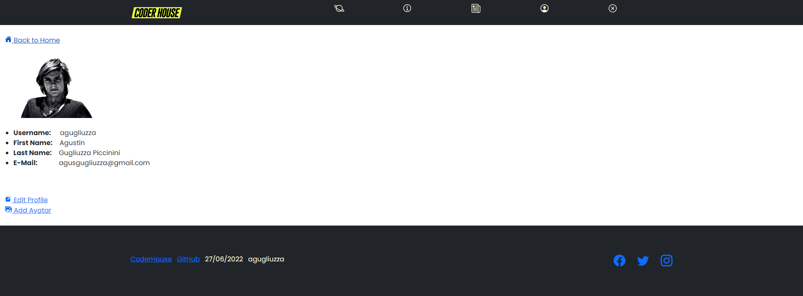
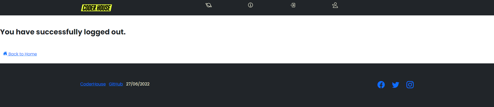

# Python-36585: TP Final
- **Alumno:** Agustín Gugliuzza Piccinini
- **E-Mail:** agusgugliuzza@gmail.com
---
## ¿Cómo utilizar la aplicación?
### (1) Clonar Repositorio de GitHub

Primero debemos clonar el repositorio en nuestro localhost, para lo cual debemos ejecutar la función de: `git clone https://github.com/agusgugliu/python-36585-blog.git` en GitBash.

### (2) Deployar Ambiente en VS Code

A continuación, debemos abrir el repositorio que acabamos de clonar en nuestro entorno de Visual Studio Code.

### (3) Realizar Migraciones y Correr el Servidor
Lo siguiente a realizar es generar las migraciones y ejecutar el server. Para hacer esto, debemos ejecutar las siguientes 3 sentencias en orden:

- `$ python manage.py makemigrations`
- `$ python manage.py migrate`
- `$ python manage.py runserver`

### (4) Navegar en la Aplicación

Una vez que ingresemos a la pantalla de la aplicación, vamos a encontrarnos con la pantalla de HomePage. En la parte superior tendremos los cuatro íconos de navegación por defecto (dado que no estamos logueados):
- Home → es la página de HomePage de la aplicación.

- Author → tiene la información del autor (personal, educativa y laboral).

- Login → si ya tenemos un usuario generado, nos permite ingresar al blog.

- SignUp → en caso de no tener un usuario, nos permite generarlo mediante username y password.

Una vez estemos logueados en la aplicación, nos aparecerán 3 íconos nuevos:
- Blog → aquí encontraremos todas las notas que se han cargado en el blog. En esta sección podremos generar una nota nueva y/o modificar o eliminar cualquiera de las notas que hayamos creado nosotros con el usuario con el que nos hemos logueado.

- Profile → nos permite editar nuestro perfil, agregando nuestro e-mail, nombre, apellido e incluso cargar una imagen que servirá como nuestro avatar.

- Logout → permite desloguearse de la aplicación.
